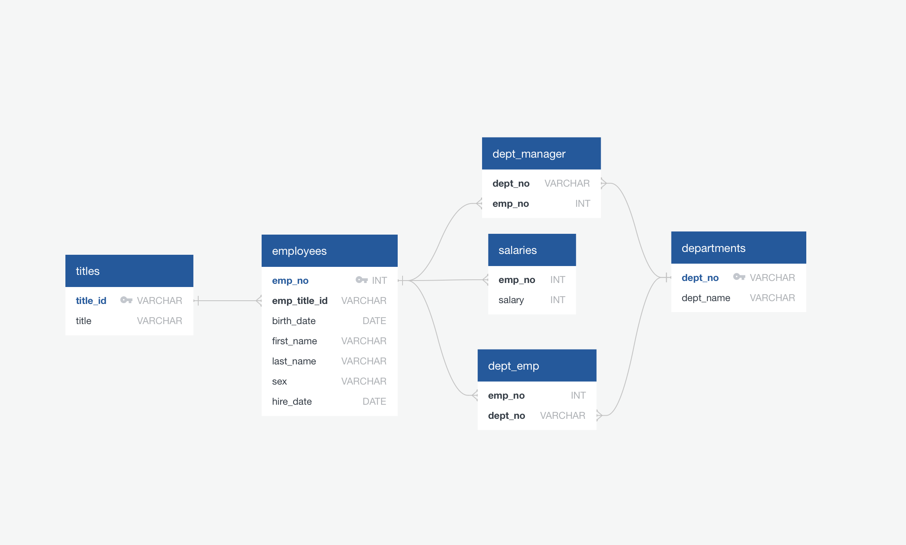
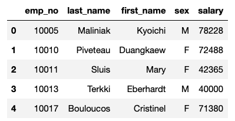
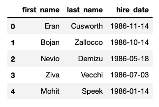
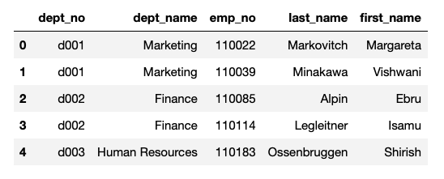
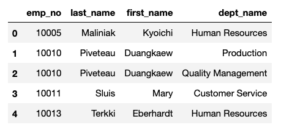
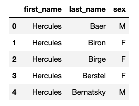
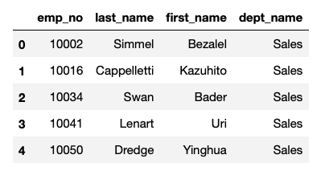
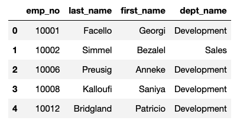
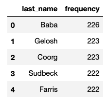

sql-challenge
#
# Employee SQL Database: Data Modeling, Data Engineering, Data Analysis
## Background

This repository discusses a research project on an employee database from the Pewlett Hackard Corporation Company during the 1980s and 1990s. All that remains of the database of employees from that period is in six CSV files.

For this project, a table was created that holds employees data in the CSVs, import the CSVs into a SQL database, and the data exploration was conducted to answer the research questions, and discussed in the following parts:

## 1. Data Modeling

To model the employee data a basic data modeling technique called  Entity-Relationship Diagrams (ERD) was used. By using this technique six employee database entities or tables are identified, these entities are `employees`, `departments`, `salaries`, `titles`, `department managers`, and `department employees`. The attribute or the data type of the entities also presented. At last, the ERD was drawn to visualize the relationships between entities/objects (primary key or foreign keys in a database). To read the detailed description of the employee database click the following link and download the PDF file. [EmployeesSQL_db_ERD_modeling.pdf](EmployeeSQL/ERD/EmployeesSQL_db_ERD_modeling.pdf)

The Entity-Relationship Diagrams (ERD) looks as follows: 



## 2. Data Engineering

By using the available information a table schema for each of the six CSV files was created, then the data types, primary keys, foreign keys, and constraints were also developed. The order of the table is based on the primary, and foreign arrangements. 

**Note** to import each CSV file into the corresponding SQL table the order strictly should be followed to avoid errors. 

Click the following link to see the actual schema file [EmployeesSQL_db_Schema.sql](EmployeesSQL_db_Schema.sql) 

## 3. Data Analysis

After completing the importing process a Postgresql analysis was perfomed and you can view the full query in this file [EmployeesSQL_db_Query.sql](EmployeesSQL_db_Query.sql)   

The analysis query performed, and cascaded in the following formats: 

1. A query to list the following details of each employee: employee number, last name, first name, sex, and salary

```SELECT employees.emp_no, employees.last_name, employees.first_name, employees.sex, salaries.salary
FROM employees
JOIN salaries
ON employees.emp_no = salaries.emp_no;

   ```


2. A query to list first name, last name, and hire date for employees who were hired in 1986.

```
SELECT first_name, last_name, hire_date 
FROM employees
WHERE hire_date BETWEEN '1986-01-01' AND '1987-01-01';

 ```


3. A query list the manager of each department with the following information: department number, department name, the manager's employee number, last name, first name.
```employee number, last name, first name.
SELECT departments.dept_no, departments.dept_name, dept_manager.emp_no, employees.last_name, employees.first_name
FROM departments
JOIN dept_manager
ON departments.dept_no = dept_manager.dept_no
JOIN employees
ON dept_manager.emp_no = employees.emp_no;
 ```


4. A query to list the department of each employee with the following information: employee number, last name, first name, and department name.
 ```SELECT dept_emp.emp_no, employees.last_name, employees.first_name, departments.dept_name
FROM dept_emp
JOIN employees
ON dept_emp.emp_no = employees.emp_no
JOIN departments
ON dept_emp.dept_no = departments.dept_no;
 
 ```


5. A query to list first name, last name, and sex for employees whose first name is "Hercules" and last names begin with "B."

```SELECT first_name, last_name,sex
FROM employees
WHERE first_name = 'Hercules'
AND last_name LIKE 'B%';

 ```


6. A query to list all employees in the Sales department, including their employee number, last name, first name, and department name.

```SELECT dept_emp.emp_no, employees.last_name, employees.first_name, departments.dept_name
FROM dept_emp
JOIN employees
ON dept_emp.emp_no = employees.emp_no
JOIN departments
ON dept_emp.dept_no = departments.dept_no
WHERE departments.dept_name = 'Sales';

 ```


7. A query to list all employees in the Sales and Development departments, including their employee number, last name, first name, and department name.

```SELECT dept_emp.emp_no, employees.last_name, employees.first_name, departments.dept_name
FROM dept_emp
JOIN employees
ON dept_emp.emp_no = employees.emp_no
JOIN departments
ON dept_emp.dept_no = departments.dept_no
WHERE departments.dept_name = 'Sales' 
OR departments.dept_name = 'Development'
 ```


8. In descending order, list the frequency count of employee last names, i.e., how many employees share each last name.

```SELECT last_name,
COUNT(last_name) AS "frequency"
FROM employees
GROUP BY last_name
ORDER BY
COUNT(last_name) DESC;

 ```


  I created this shareable link to my repository <https://github.com/jdelacruzjr/sql-challenge.git> and submitted it to <https://bootcampspot-v2.com>
### Copyright

Trilogy Education Services © 2023. All Rights Reserved.